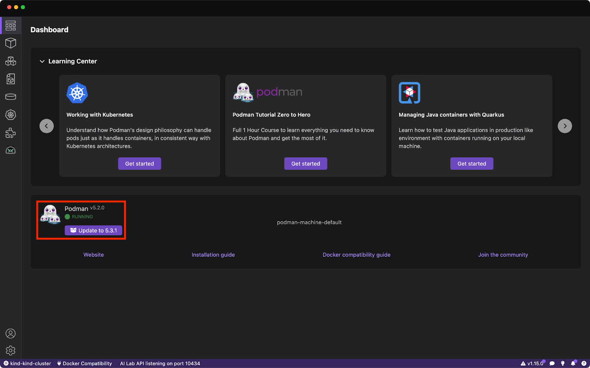
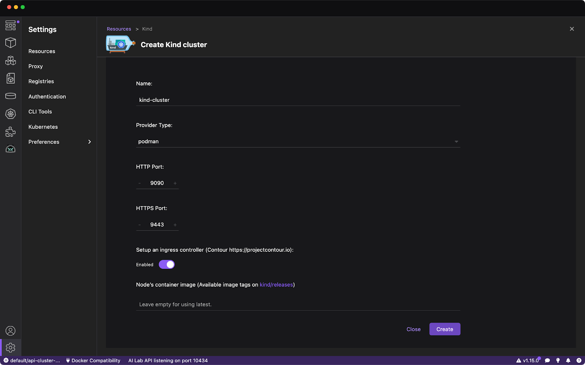
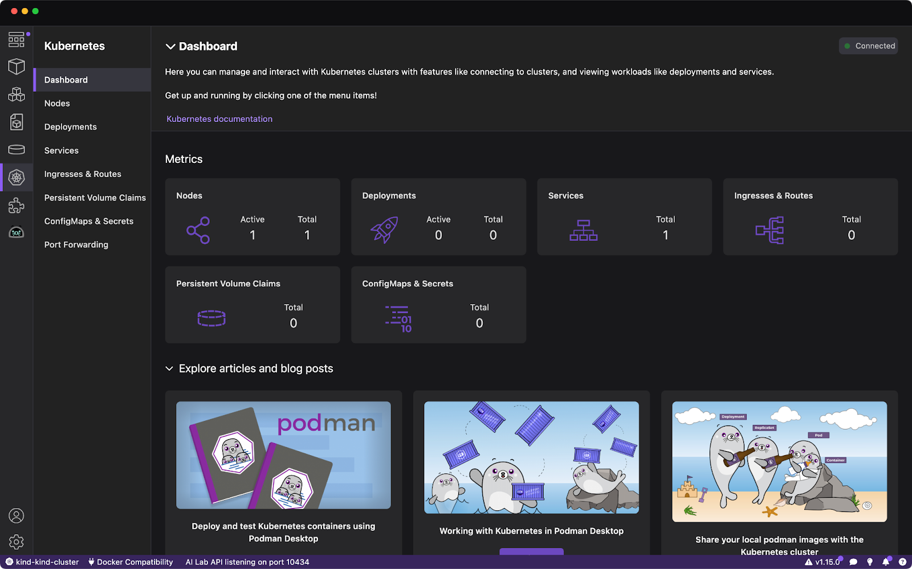
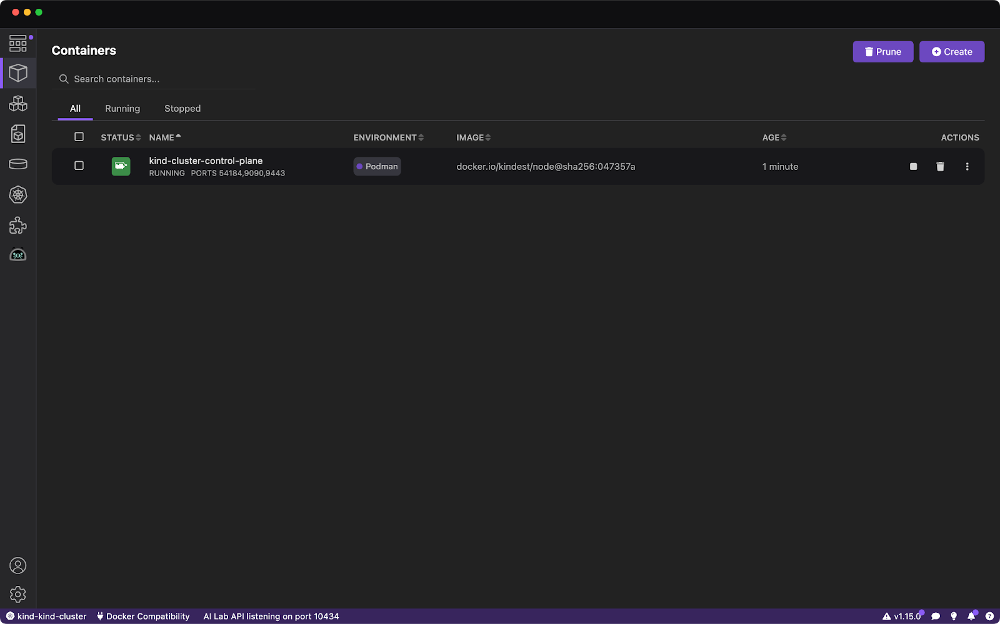
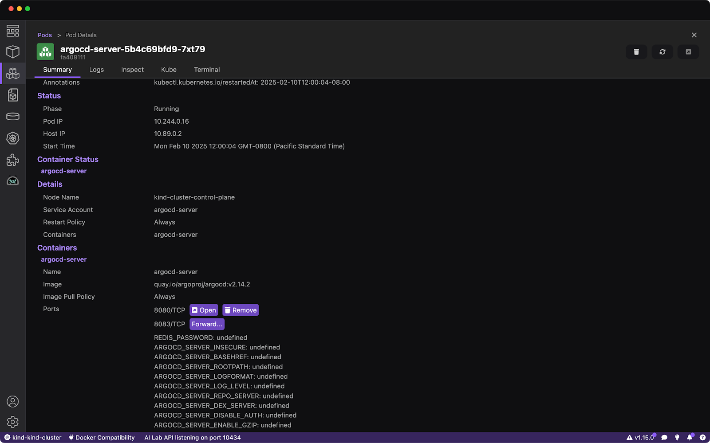
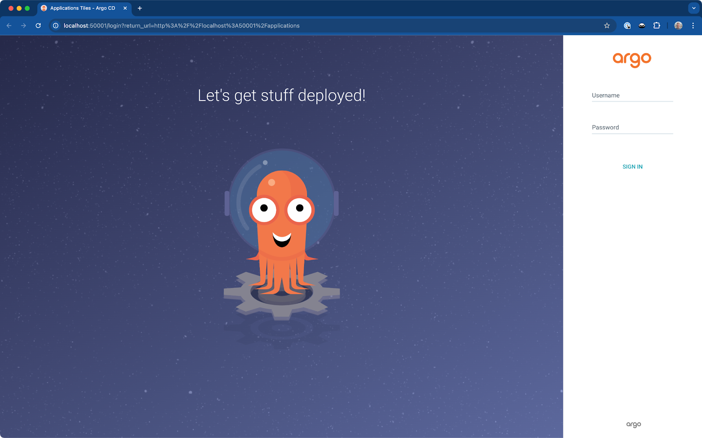
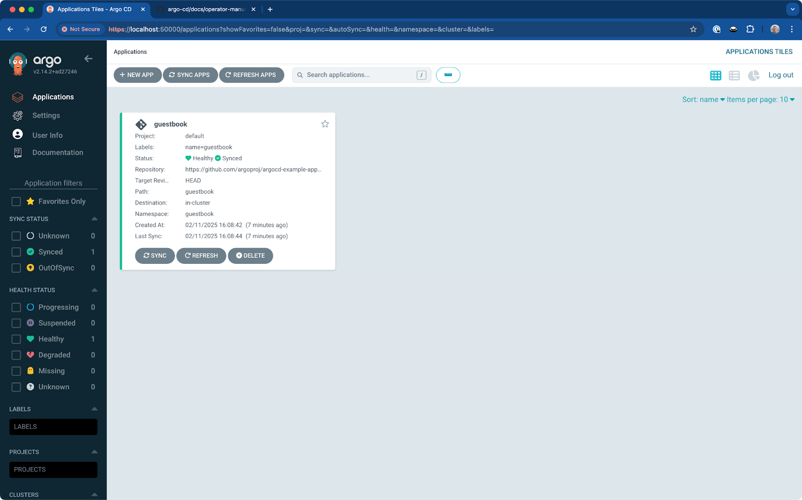

import ReactPlayer from 'react-player'
import useBaseUrl from '@docusaurus/useBaseUrl';
import ThemedImage from '@theme/ThemedImage';
import Tabs from '@theme/Tabs';
import TabItem from '@theme/TabItem';

GitOps is the practice of using configuration files stored in Git as the source of truth for the desired state of systems, such as infrastructure and application deployments. Changes to these files act as a trigger to update the state of the system using CI/CD tooling. In the cloud-native world, GitOps is often implemented using [Argo CD](https://argo-cd.readthedocs.io/en/stable/) and [Kubernetes](https://kubernetes.io/). Argo CD is a popular [Cloud Native Computing Foundation (CNCF)](https://cncf.io) project that enables the continuous delivery of containerized applications on Kubernetes.

Getting started with Argo CD and Kubernetes can be intimidating, but fear not! This article will guide you through the process of using Argo CD to enable GitOps-based deployments on a lightweight Kubernetes cluster powered by [Kind](https://kind.sigs.k8s.io/). Podman Desktop will tie the experience together by providing a centralized location to manage your Kubernetes cluster and containers.

<!-- truncate -->

## Why Podman Desktop and Local Development?

Running a lightweight Kubernetes cluster locally provides multiple benefits:

- **Fast Feedback**: Using a local development environment provides shortened feedback cycles for developers testing manifests, removing the need to wait for remote environments to provision.
- **Debugging**: Generally speaking, it’s easier to debug issues in a local environment and helps developers identify issues earlier in the development cycle.
- **Improved Workflow**: Developers can work independently in a consistent environment, without affecting shared environments. They can also easily replicate specific deployment scenarios.

## Prerequisites

Before getting started, make sure to follow the installation instructions for [Podman Desktop](https://podman-desktop.io/docs/installation), [kubectl](https://kubernetes.io/docs/reference/kubectl/) (Kubernetes CLI), and [Kind](https://kind.sigs.k8s.io/docs/user/quick-start/#installation).

Podman Desktop is configured correctly when you see that Podman is reported as Running on the dashboard screen.



Confirm that the `kind` and `kubectl` binaries are available in your terminal, and you’re ready to go!


## Deploy Argo CD on Kubernetes

### Create a Single-Node Kubernetes Cluster

Use the _Resources_ section in Podman Desktop’s _Settings_ screen to create a single-node Kubernetes cluster using Kind. Accept the default parameters, click _Create_, and your cluster will be ready within a minute or two.



Once the cluster is ready, you can visit the Kubernetes screen in Podman Desktop to see some high-level cluster metrics.



### Install Argo CD on your Kubernetes Cluster

The single-node Kubernetes cluster that was created by Kind is just a container running in your development environment. Confirm this by visiting the _Containers_ screen in Podman Desktop as shown.



To install Argo CD in your cluster you’ll need to run a couple of commands. You can do this directly from Podman Desktop! Get started by clicking the _kind-cluster-control-plane_ in the list of containers, and selecting the _Terminal_ tab on the _Container Details_ screen. Install the Argo CD manifests using the following commands:

```bash
kubectl create namespace argocd
kubectl apply -n argocd -f https://raw.githubusercontent.com/argoproj/argo-cd/stable/manifests/install.yaml
```

Use the `kubectl get pods -w -n argocd` command to watch the Argo CD Pods start. Once all Pods report a status of _Running_ you can move on to the next step.

### Get the Argo CD Admin Password

Accessing the Argo CD instance requires the admin user password. Retrieve it from the _argocd-initial-admin-secret_ using the same terminal that you used to run prior commands:

```bash
kubectl get secrets argocd-initial-admin-secret -n argocd -o jsonpath={.data.password} | base64 -d | xargs
```

### Access Argo CD

With the admin password in hand, you can either configure an Ingress or use Podman Desktop to forward the _argocd-server_ port to localhost to make Argo CD accessible - this article uses the latter approach.

Using a terminal on your host machine, run the following command to ensure the Argo CD Pods are displayed in the Podman Desktop Pods screen. Refer to [Viewing and selecting the current Kubernetes context documentation](https://podman-desktop.io/docs/kubernetes/viewing-and-selecting-current-kubernetes-context) for more information on switching contexts.

```bash
kubectl config set-context --current --namespace argocd
```

Select the _Pods_ screen in Podman Desktop and locate the Pod with the _argocd-server_ prefix. Select that Pod and a summary page will appear. Click the _Forward_ button for port 8080/TCP.

:::note

Make sure to update to Podman Desktop v1.16, or run the following commands from the kind-cluster-control-plane container to disable SSL on the Argo CD Server to ensure port-forwarding works.

```bash
kubectl patch configmap argocd-cmd-params-cm --type merge -p '{"data": {"server.insecure": "true"}}'
kubectl rollout restart deployment argocd-server
```

:::



Click on the _Open_ button to visit the Argo CD login page. Login using the _admin_ user and the password you obtained earlier from the _argocd-initial-admin-secret_.



## Create an Application in Argo CD

You can create your first [Application](https://argo-cd.readthedocs.io/en/stable/user-guide/application-specification/) from the Argo CD web interface. Click the _New App_ button, then use the _Edit as YAML_ button to access the YAML editor. Paste the contents of [this example application.yaml](https://github.com/argoproj/argo-cd/blob/master/docs/operator-manual/application.yaml) into the editor, save it, then click _Create_.

The _guestbook_ Application will appear in the Argo CD web interface, and will eventually complete the deployment process and report that it’s both _Healthy_ and _Synced_.



## Conclusion

Podman Desktop provides tooling that enables developers to manage lightweight Kubernetes clusters using Kind, and experiment with GitOps workflows using CNCF projects such as Argo CD. You can read more about [managing Kubernetes with Podman Desktop in the documentation](https://podman-desktop.io/docs/kubernetes).
